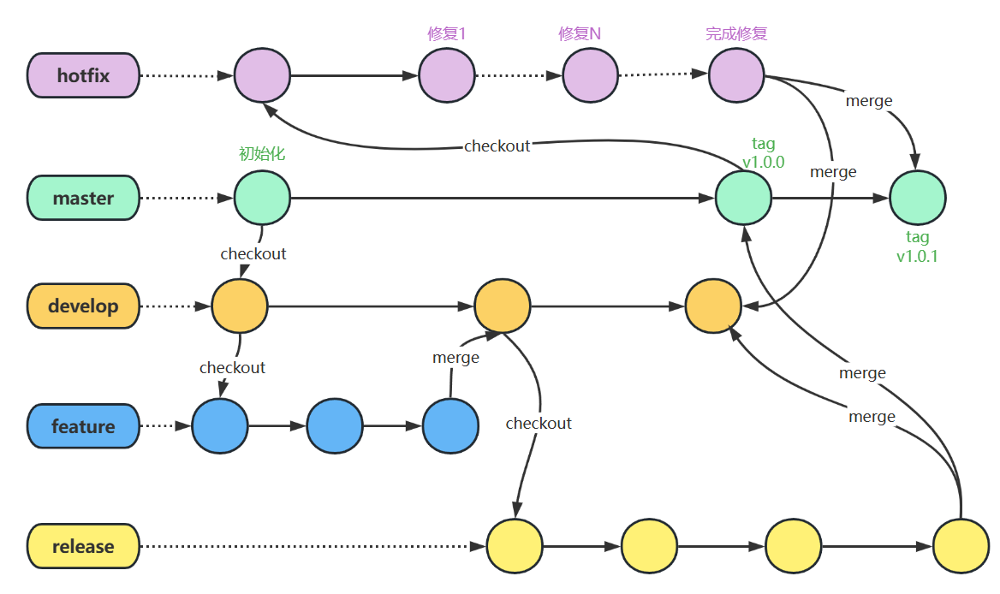

## 什么是GitFlow?

为了更好的团队协作和版本管理，程序员们发明了一种工作流程——GitFlow工作流。GitFlow 是一种 Git 工作流，这个工作流程围绕着项目的发布(release)定义了一个严格的如何建立分支的模型。它是团队成员遵守的一种代码管理方案 。

Git Flow 由 Vincent Driessen 在 2010 年提出，并通过一套标准的分支命名和工作流程，使开发、测试和发布过程更加有序和高效。Git Flow 主要由以下几类分支组成：`hotfix`、`master`、`develop`、`feature`、`release`。

> 本文主要简单的介绍GitFlow的大致的框架，同时GitFlow只是一个指导方针，而非铁律，在必要情况下可以自行的组合和修改。

## GitFlow规定的主要分支

### 分支的种类和功能

| 分支名称格式    | 分支说明                                                     |
| --------------- | ------------------------------------------------------------ |
| `main`/`master` | 生产环境主分支，存放可直接上线的稳定代码，仅通过合并更新，不直接开发 |
| `develop`       | 开发主分支，承载日常功能开发，集成已完成的功能分支，是开发阶段的核心分支 |
| `feature`       | 功能开发分支，从`develop`创建，完成后合并回`develop`，用于隔离单个功能开发 |
| `hotfix/`       | 紧急修复分支，从`main`创建，修复生产 bug 后合并回`main`和`develop`，临时存在 |
| `release`       | 发布准备分支，从`develop`创建，用于发布前的小修复和版本调整，完成后合并到`main`和`develop` |

### Hotfix分支

hotfix分支也叫作热修改分支，用于解决线上的问题，修改完成后合并回master分支和develop分支。当生产环境中的代码遇到严重到必须立即修复的缺陷时，从主分支中拉取hotfix分支-->修改bug-->验证修复完成后-->合并到master分支（tag更新为x.x.1）和develop分支-->删除hotfix分支。hotxfixd的命名规则：`hotfix/[问题类型]-[核心描述]-[可选版本号]`。

一个项目发布后或多或少肯定会有一些bug存在，而bug的修复工作并不适合在develop上做，而在hotfix上做，这是因为：

- develop分支上包含还未验证过的feature

- 用户未必需要develop上的feature

- develop还不能马上发布，而客户急需这个bug的修复

### Master分支

也称主线分支或者基线分支，是核心的分支。它包含项目的核心稳定版本（正式版本），同时要保证主线分支的代码是可以随时发布的，也要保证代码可以随时在生产环境中使用。

主线分支不被允许直接修改，只能通过合并分支的方式修改，每一次合并分支都建议生成一个新的版本号（`tag`），主线分支接受来自release和hotfix的合并请求。

常见的版本号命名规则：

- 主版本：主要功能变化或者重大更新。
- 次版本：一些新的功能、改进、更新，通常不影响现有功能。
- 修订版本：一些小的bug修复，安全漏洞补丁等。通常不会更改现有功能和接口

### Develop分支

Develop分支即开发分支。从主线分支上拉取上来，包含了项目的最新开发版本的代码，用于开发和测试，其上更新的代码为下一个发布版本要交互的新功能。当开发完成或者到达目标阶段时，应该从改点拉取一个预发分支并附上发布版本号，开发分支会接受其他辅助分支的合并，但合入的分支不能影响开发分支的正常运行。

### Feature分支

Feature分支即功能分支。一般包含项目某个新功能的代码，用于开发新功能。功能分支从开发分支中拉取，当功能分支稳定后，合并到开发分支。这个分支一般在开发人员的本地库，这个分支一般不提交到远程代码库里。Feature分支的命名规则：`Feature/xxx`。

### Release分支

Release 分支是专门用于版本发布前准备工作的临时分支，核心作用是在开发完成后、正式发布到生产环境前，隔离并处理发布相关的最终调整，确保生产环境代码的稳定性。

简单说，它就像 “发布前的缓冲带”—— 当开发分支（develop）上的功能都已完成，就从 develop 创建 Release 分支，允许做小量级的Bug修复和准备发布版本的元数据信息（版本号、编译时间等）文档更新等发布前的收尾工作不允许新增功能。

通过创建预发分支，使得开发分支得以空闲出来接受下一个版本的新的功能分支的合入。完成后，这个分支会同时合并到生产分支（main）和开发分支（develop）。这样既能既保证了发布版本的纯净性，又不影响 develop 分支继续开发新功能，是连接开发与生产的关键过渡环节。Release分支命名规则：`Release/版本号`。

